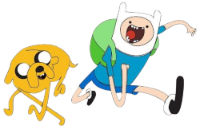

# Game Ideas and Suggestions

## Suggestions for Game Types

Here are some suggestions for types of game that you could develop and program:

Remember that you need to demonstrate 'advanced' programming techniques, so you want to aim for a game that requires the use of lists to store the game data, etc.

### Adventure Games

Games that allow players to progress through a world of some kind, facing challenges and performing actions to overcome them...
- Items could be collected
- Battles could be won
- etc.

### Grid Games

Game counters / pieces could be placed on a one-dimensional grid (e.g. Old Gold - see [below](#old-gold-game)), or two-dimensional grid to achieve a particular result, e.g... 
- Lining-up a number of counters
- Removing / taking other counters
- etc.

### Dice Rolling Games

Games that allow players to 'roll' multiple dice to gain points / beat the other player based on the dice rolled...
- Certain patterns of dice might score more highly than others
- Certain patterns of dice might cause a loss of points / lives, etc.

### Word Games

Players could be shown a set of letters / a word, and have to do something with the letters, e.g.
- Creating new words from the letters, and gaining points for length of word
- Guessing the scrambled-up word, and gaining points for the time taken
                 
---

## Old Gold Game

This is a two-player game, played on a one-dimensional grid with coins, where the aim is to win by being the player who **removes the gold coin**. 

### Game Setup

A number of coins are placed at random positions on a one-dimensional, square grid. One of the coins is a gold coin. 
The size of the grid and the number of coins can vary. 

As an example, we will use a grid of 20 squares, and six coins (5 normal, 1 gold):

The coins are **placed randomly** onto the grid...

                     
### Game Rules

The rules are:
- Players take turns
- A turn can be either:
  - Removing a coin from the left square (if there is one), or
  - Sliding any coin left
- Coins can slide any number of empty squares
- Coins cannot jump on or over another coin

### Gameplay

Play begins... Taking turns, each player can do one of the following:
- **Slide** any coin a number of spaces to the **left**, as long as:
  - Other coins are **not jumped** 
  - It does **not share the same square** as another coin
- **Remove** a coin from the far-left square (position 1) if one is there

So, the valid plays in our example would be...

(Only the coin at position 9 can't be moved, since there is no space to its left)

The aim is to win by being the player who **removes the gold coin** from the left-most square. So each player tries to force the other player to move the gold coin to that point.

### Example Play-Through

This is an example game play-through showing the moves made by each player, and the final winner...

