# Results of Testing

The test results show the actual outcome of the testing, following the [Test Plan](test-plan.md)

---

## First off display the logo and the how to play instructions

I have made my game displaying the logo using www.asciiart.eu to help create it. I also added the how to play instructions as soon as you run the game. Later on I will have the (A) Start function and (B) End
function to replace them before they display after a choice is made

### Test Data To Use

I will run it and the logo should appear with the how to play

### Test Result

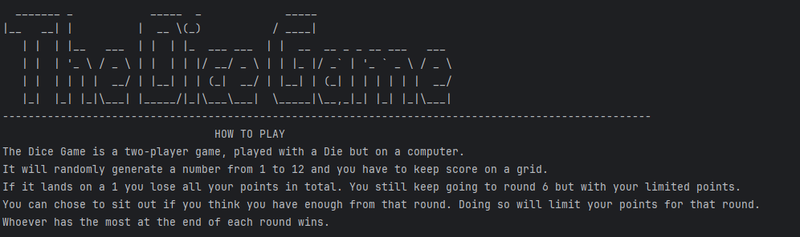

The logo displays well and the instructions are clear.

---

## Test the Player 1 and Player 2 work

I have made the game ask Player 1 to input their name so they can be identified when asked to do specific things. The same thing will occur for player 2 as well.

### Test Data To Use

Once run and player 1 and 2 have inputed their names it will display their names by welcoming them then telling them how to play and what to do.

### Test Result 1 - Player 1 can be inputed and works
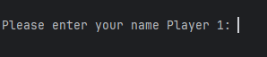 

### Test Result 2 - Player 1 is welcomed to the game and then player 2 is asked for name
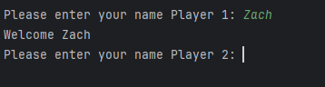 

### Test Result 3 - It introduces both player 1 and 2 to the game and explains what to do to start the game
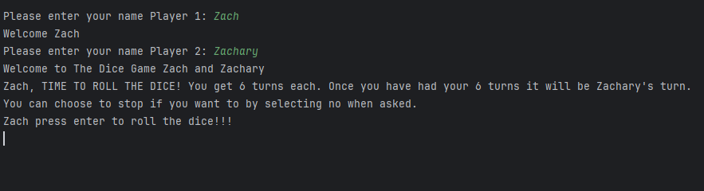

### Test Result 4 - it won't let any players not input a name and will go on infinitely unless a character is inputed
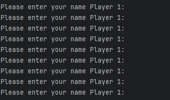

---

## Test the game structure works with the key components of random number (dice) and scoring

I have made my game display the roll they are on, the number the dice has rolled and how many points they have. The game then asks if they want to roll again. 
For now when they put no the game breaks. But once the round is up it will display how many points they have.

### Test Data To Use

I will run it and a dice roll random number, total points and what roll your on will be produced 

### Test Result
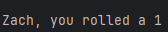

### Test Result - points so far
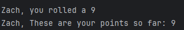

### Test Result - Roll ......
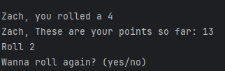

### Test Result Player 1
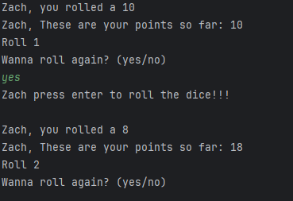

### Test Result Player 1 (2)
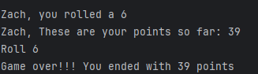

### Test Result Player 2
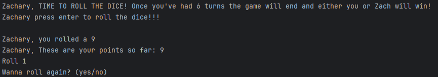

### Test Result Player 2 (2)
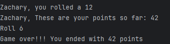

I got the game to allow both player 1 and 2 to both game 6 rounds each after player 1 had finished. The game works with both the dice and the rolls counted. The total score
also works too and it displays them at the end. In some case I had a bug where sometimes the game would run and would double up names. Changed Val and it worked.

---

## Number to lose

I wanted the generator to generate a number that when received will make the user lose all their points. I have made it so the number
is 1. 

### Test Data To Use

I ran the code that when the 1 is generated it erases all points built up from the beginning and still allows the user to carry on in case
they make up their points.

### Expected Test Result - loosing all your points

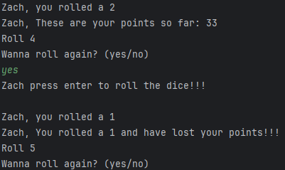

### Expected Test Result - After you have lost all your points
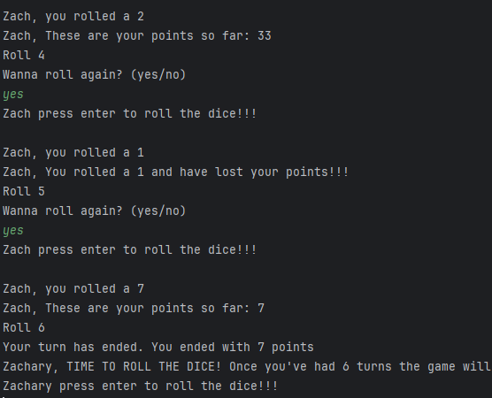

---

## Sit down, stay standing
With the idea of greedy pig in mind I got the user to have a choice that once they have received a good score that 
they like they can choose to sit down or keep standing (Stop or keep going). It works as with my yes and no functions
the user can choose either but when the code registers more than 5 rolls have been done it automatically puts no to
stop the user from having more than 6 turns.

### Test Data To Use

I ran code that has the yes or no you type to sit down and stop receiving points. The scores will be gone from roll 1 
if the number 1 comes up. If they sit down they keep their points from roll 1 till they stop. Once 1 comes up though
they can still carry on just with refreshed points.

### Expected Test Result
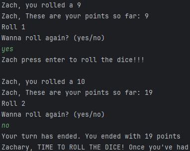

---

## Winner

I got the game at the end to display who the winner is and how many points they had that made them win. The game
displays a somewhat personalised message of "Congratulations". Then for the player who lost it says, "Unfortunately you lost".

### Test Data To Use

I ran code that when the game is finished the winner has there name displayed with their points and the game will end. The same with
the player who lost underneath. I did this with a basic "if player > player2" function to display the winner.

### Expected Test Result
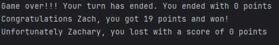

---

## (A) Start, (B) End

I changed the games beginning screen to show the (A) Start and (B) End. This helps as there is almost nothing there
except that to make it easier on the user to choose and option instead of having all the how to play instructions
there first then the choices. When the user makes choice (A) it displays the logo and how to play before asking them to
type there names. If they select (B) the game simply thanks them for playing and ends.

### Test Data To Use

I run the code that when the game starts it shows the choices and they choose 1 to take them where they want.

### Expected Test Result - (A) Start (B) End
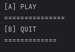

### Expected Test Result - (A) Start choice
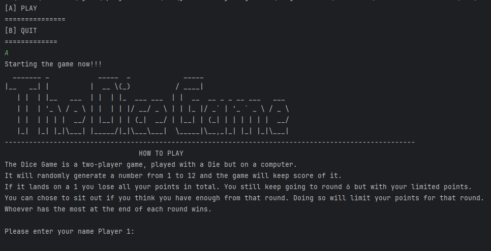

### Expected Test Result - (B) End choice
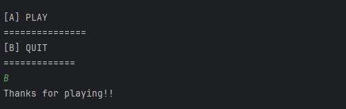

---